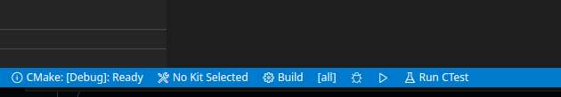
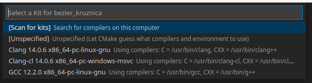

# Computer grapics repo
Culmination of all projects done at CG lectures @ PMF. These are not mine,they are just slightly edited and used for learning.
Used materials are from these sources:
* [Računalna grafika FER](http://www.zemris.fer.hr/predmeti/ra/)
* [Računalna grafika PMF](https://www.pmf.unizg.hr/math/predmet/racgra)

Shader class is modified version of a class from 
* [LearnOpenGL](https://learnopengl.com/)  ```CC BY-NC 4.0```


## Requirements:

1. Cmake latest version
2. OpenGL version > 4
3. VSCode
4. linux package for git

## Initialization
1. clone repo
2. in root folder run this lines:
3. ```git submodule init```
4. ```git submodule update```
5. occasionally ```git pull``` to get new updates


## Usage (VSCode)

> You need CMake addon for VSCode (it will suggest it to you to install it when you run the project)



1. open project folder in VSCode (```code .``` in terminal)
2. press ```Build```



3. select compiler: ```GCC```
4. select ```▷``` to run project

## Usage (without VSCode)

1. open project folder
2. ```mkdir build```
3. ```cd build```
4. ```cmake ..```
5. ```make```
6. ```./project_name```

## Usage: clean all build files

Just run ```./clean.sh```

